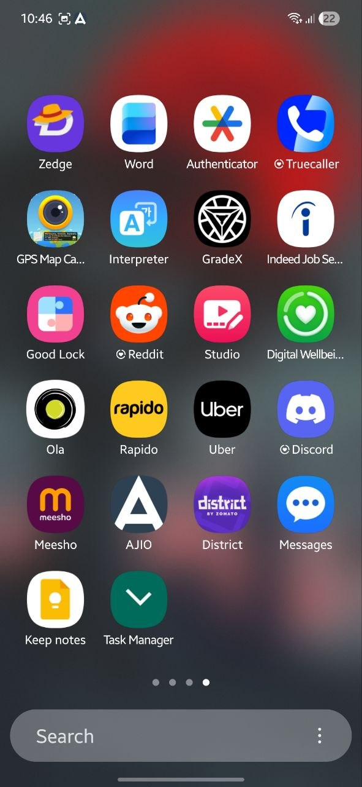
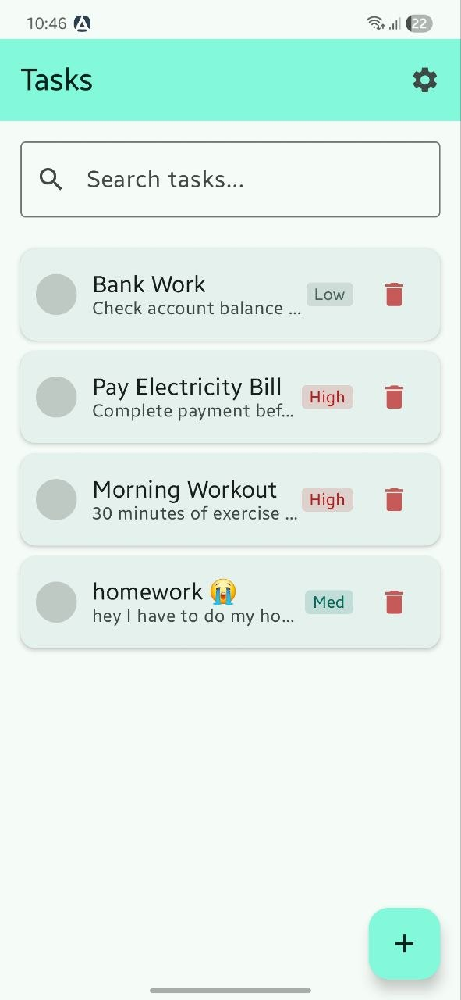
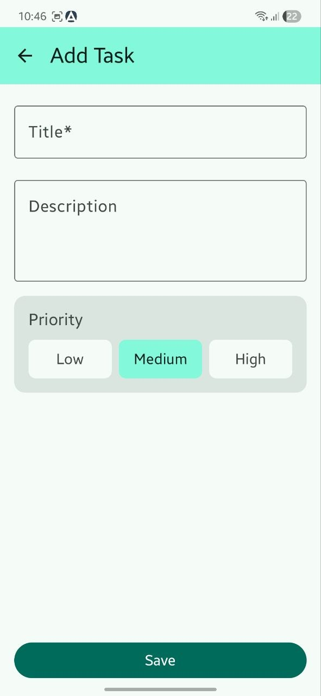
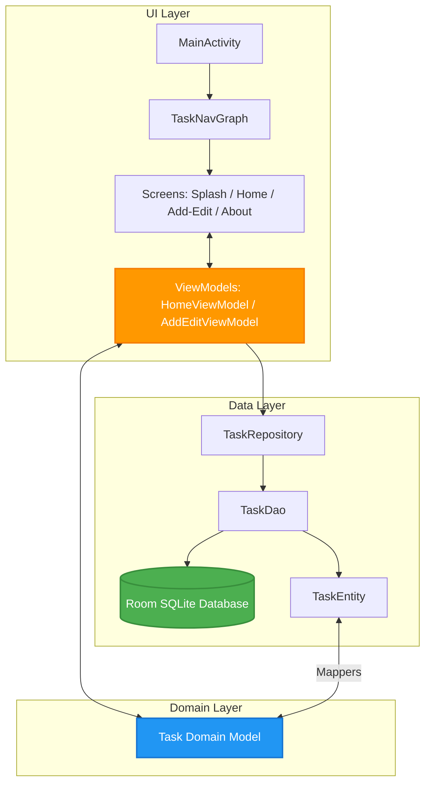

# 🎯 Task Manager

[](https://kotlinlang.org/)
[](https://developer.android.com/compose)
[](https://developer.android.com/training/data-storage/room)
[](https://developer.android.com/training/dependency-injection/hilt-android)
[](LICENSE)

An elegant, offline-first task management Android application demonstrating modern architecture patterns (MVVM + clean architecture), declarative UI, reactive data flow, and dependency injection.

---

## 📸 App Screenshots

Below is a gallery of the Task Manager app in action, showing the splash screen, task list, styling, and forms:

<div align="center">
  <table>
    <tr>
      <td><br/><sub><b>Splash Screen</b></sub></td>
      <td><br/><sub><b>Home Screen</b></sub></td>
      <td><br/><sub><b>Add Task</b></sub></td>
      <td><br/><sub><b>Task Customization</b></sub></td>
      <td><br/><sub><b>About Screen</b></sub></td>
    </tr>
  </table>
</div>

---

## ⚡ Tech Stack & Architecture

This project is built using industry-standard libraries and architectures:

* **Core & Async**: [Kotlin](https://kotlinlang.org/), Coroutines, and [Flow / StateFlow](https://kotlinlang.org/docs/flow.html) for reactive streams.
* **UI**: [Jetpack Compose](https://developer.android.com/compose) utilizing Material 3 components and edge-to-edge layouts.
* **Database**: [Room Database](https://developer.android.com/training/data-storage/room) for persistent local cache.
* **Dependency Injection**: [Hilt (Dagger)](https://developer.android.com/training/dependency-injection/hilt-android) for class decoupling and testability.
* **Navigation**: Type-safe navigation utilizing the [Compose Navigation Component](https://developer.android.com/develop/ui/compose/navigation).

### Architecture Flow

The codebase follows the official Android Architecture Guidelines (MVVM with Clean Architecture flow):



---

## 🚀 Getting Started

### Prerequisites
* **Android Studio** (Koala or newer)
* **JDK 17**
* **Android SDK** API level 34+

### Clone & Build
```bash
git clone https://github.com/TSR0705/Android-TaskManager-App.git
cd Android-TaskManager-App
```
1. Open the folder in Android Studio and let Gradle sync.
2. Select an emulator or connect a device and click **Run** (`Shift + F10`).

### Build APK
Generate a debug APK from the root directory:
```powershell
# Windows
./gradlew assembleDebug

# macOS / Linux
./gradlew assembleDebug
```
The compiled output is located at: `app/build/outputs/apk/debug/app-debug.apk`

---

## 📄 License
Licensed under the [MIT License](LICENSE).
